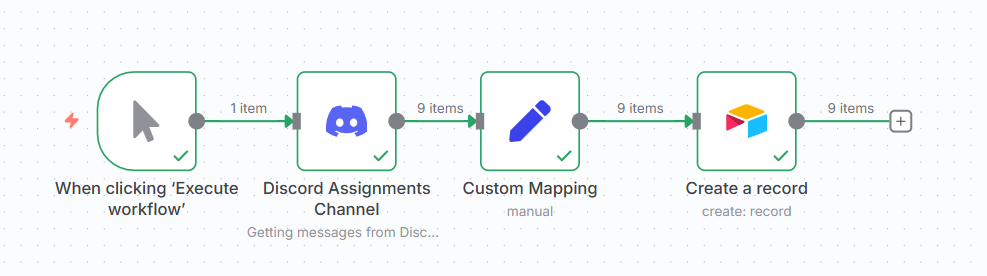

### Discord integration with airtable for PIAIC assignments

##### Description 

📌 n8n Discord → Airtable Integration

This workflow listens to messages coming from a Discord channel, extracts message details (author, content, and file attachments), and saves them into Airtable.

🔹 Features

Captures User ID and Username from the Discord message.

Stores the Message Content into Airtable.

Automatically uploads Attachments (images/files) into Airtable’s attachment field.

Ensures attachments are passed as valid arrays to match Airtable’s format.

🔹 Workflow Steps

Discord Trigger → Captures incoming messages with metadata and attachments.

Data Mapping → Extracts fields like author.id, author.username, content, and attachments.

Attachment Handling → Converts each file into Airtable’s required format:

[
  {
    "url": "https://cdn.discordapp.com/attachments/.../file.jpg",
    "filename": "file.jpg"
  }
]

Airtable Record Creation → Saves the extracted data into your Airtable base.
